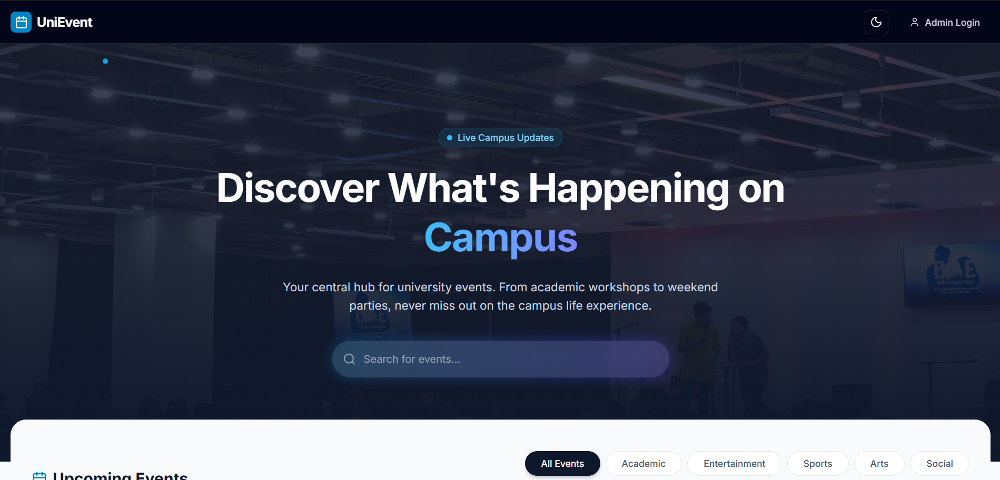
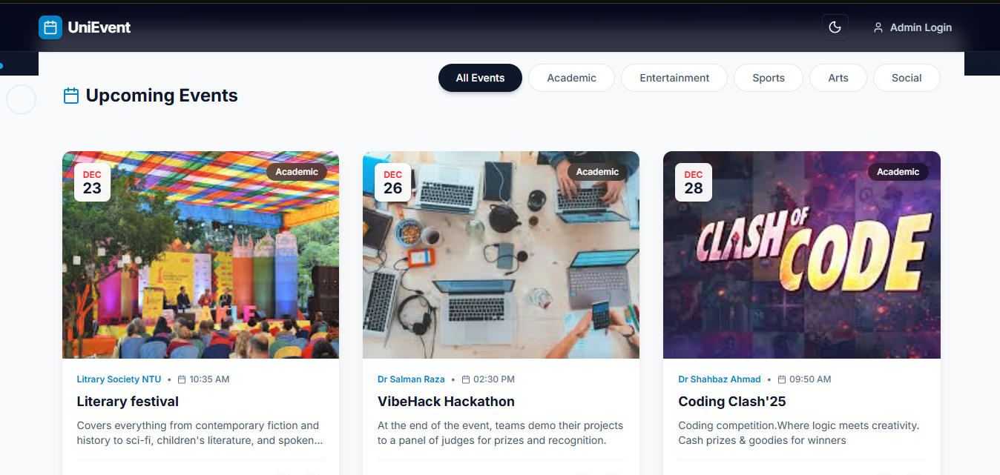
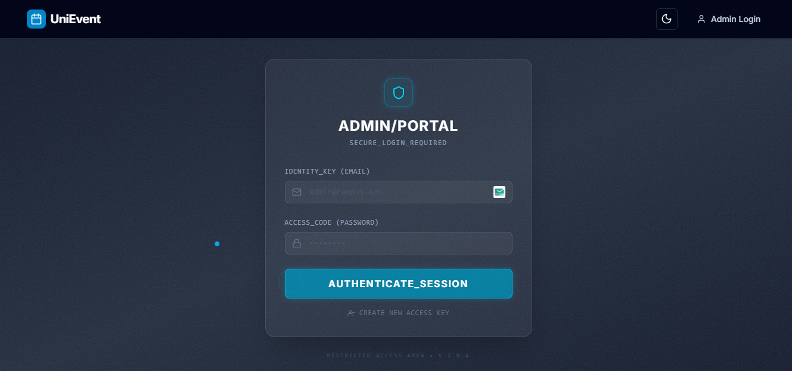
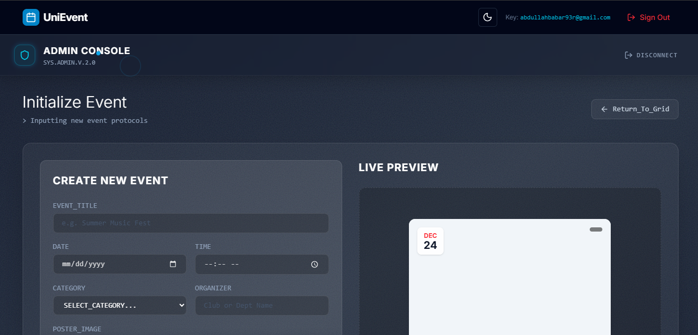

# UniEvent 🎓 CampusConnect-Platform

> A centralized campus event discovery platform that makes it easy for students to explore and participate in university events.

[](https://opensource.org/licenses/MIT)
[](https://firebase.google.com/)
[]([https://your-project-id.web.app](https://unievent-84e46.web.app))

🌐 **Live Demo**: ([Website-Link](https://unievent-84e46.web.app))

## 📋 Table of Contents

- [Overview](#overview)
- [Features](#features)
- [Screenshots](#screenshots)
- [Technologies Used](#technologies-used)
- [Prerequisites](#prerequisites)
- [Installation & Setup](#installation--setup)
- [Firebase Configuration](#firebase-configuration)
- [Deployment](#deployment)
- [Usage](#usage)
- [Admin Panel](#admin-panel)
- [Project Structure](#project-structure)
- [Contributing](#contributing)
- [License](#license)
- [Contact](#contact)

## 🎯 Overview

**UniEvent** is a comprehensive campus event discovery platform designed to centralize all university events in one intuitive interface. Students can effortlessly browse, search, and filter events, while administrators have full control over event publishing and management through a secure admin panel.

The platform leverages Firebase's robust infrastructure for real-time data synchronization and secure authentication, ensuring a seamless experience for both students and event organizers.

## ✨ Features

### For Students
- 🔍 **Browse Events**: Discover all upcoming campus events in one centralized location
- 🔎 **Advanced Search & Filter**: Find events by category, date, popularity, or keywords
- 📱 **Responsive Design**: Mirror-style, modern UI that works seamlessly across all devices
- ⚡ **Real-time Updates**: Instantly see newly published events without refreshing

### For Administrators
- 🔐 **Secure Authentication**: Firebase Authentication for admin login
- ➕ **Event Management**: Create, edit, and delete campus events
- 🖼️ **Poster Management**: Upload and manage event posters
- 📊 **Real-time Database**: All changes sync instantly across the platform
- 🎨 **Rich Content Editor**: Add detailed descriptions, images, and event information

## 📸 Screenshots

<!-- Add your screenshots here -->

### Student View

*Browse all upcoming campus events*


*View detailed event information*

### Admin Panel

*Secure admin authentication*


*Manage events and posters*

> **Note**: Replace placeholder images with actual screenshots from your application.

## 🛠️ Technologies Used

### Frontend
- **Framework**: React.js / Vue.js / HTML5, CSS3, JavaScript (ES6+)
- **Styling**: CSS3, Modern CSS Grid/Flexbox
- **UI/UX**: Mirror-style design with responsive layout

### Backend & Database
- **Firebase Realtime Database**: Event and poster data storage
- **Firebase Authentication**: Secure admin authentication
- **Firebase Hosting**: Production deployment platform
- **Firebase Storage**: Event poster and image storage

### Additional Tools
- **Version Control**: Git & GitHub
- **Package Manager**: npm / yarn

## 📦 Prerequisites

Before you begin, ensure you have the following installed:

- **Node.js** (v14.0 or higher)
- **npm** or **yarn**
- **Git**
- A **Firebase** account ([Create one here](https://firebase.google.com/))

## 🚀 Installation & Setup

### 1. Clone the Repository

```bash
git clone https://github.com/yourusername/unievent.git
cd unievent
```

### 2. Install Dependencies

```bash
npm install
# or
yarn install
```

### 3. Set Up Environment Variables

Create a `.env` file in the root directory:

```env
REACT_APP_FIREBASE_API_KEY=your_api_key
REACT_APP_FIREBASE_AUTH_DOMAIN=your_auth_domain
REACT_APP_FIREBASE_DATABASE_URL=your_database_url
REACT_APP_FIREBASE_PROJECT_ID=your_project_id
REACT_APP_FIREBASE_STORAGE_BUCKET=your_storage_bucket
REACT_APP_FIREBASE_MESSAGING_SENDER_ID=your_messaging_sender_id
REACT_APP_FIREBASE_APP_ID=your_app_id
```

### 4. Start the Development Server

```bash
npm start
# or
yarn start
```

The application will open at `http://localhost:3000`

## 🔥 Firebase Configuration

### Step 1: Create a Firebase Project

1. Go to the [Firebase Console](https://console.firebase.google.com/)
2. Click "Add Project" and follow the setup wizard
3. Name your project (e.g., "UniEvent")

### Step 2: Enable Firebase Services

#### Realtime Database
1. In the Firebase Console, navigate to **Build** → **Realtime Database**
2. Click "Create Database"
3. Choose your region and start in **test mode** (or configure security rules later)

#### Authentication
1. Navigate to **Build** → **Authentication**
2. Click "Get Started"
3. Enable **Email/Password** sign-in method
4. Create your first admin user in the **Users** tab

### Step 3: Get Firebase Config

1. Go to **Project Settings** (gear icon)
2. Scroll down to "Your apps" and select the web platform (`</>`)
3. Register your app and copy the configuration object
4. Paste the values into your `.env` file

### Step 4: Database Structure

Your Firebase Realtime Database should follow this structure:

```json
{
  "events": {
    "event_id_1": {
      "title": "Tech Workshop 2024",
      "description": "Learn about the latest web technologies",
      "category": "Technology",
      "date": "2024-02-15",
      "time": "14:00",
      "location": "Main Auditorium",
      "posterUrl": "https://...",
      "popularity": 150,
      "createdAt": "2024-01-10T10:00:00Z"
    }
  }
}
```

### Step 5: Security Rules (Important!)

Update your Firebase Realtime Database rules:

```json
{
  "rules": {
    "events": {
      ".read": true,
      ".write": "auth != null"
    }
  }
}
```

## 🚀 Deployment

UniEvent is deployed on **Firebase Hosting**, providing fast, secure, and reliable hosting for the application.

### Deployment Steps

#### 1. Install Firebase CLI

```bash
npm install -g firebase-tools
```

#### 2. Login to Firebase

```bash
firebase login
```

#### 3. Initialize Firebase Hosting

```bash
firebase init hosting
```

Follow the prompts:
- Select your Firebase project
- Set `build` or `dist` as your public directory (depending on your framework)
- Configure as a single-page app: **Yes**
- Set up automatic builds with GitHub: **Optional**

#### 4. Build Your Project

```bash
npm run build
# or
yarn build
```

#### 5. Deploy to Firebase

```bash
firebase deploy --only hosting
```

Your app will be deployed to: `https://your-project-id.web.app`

### Continuous Deployment (Optional)

Set up GitHub Actions for automatic deployment:

Create `.github/workflows/firebase-hosting-merge.yml`:

```yaml
name: Deploy to Firebase Hosting on merge
on:
  push:
    branches:
      - main
jobs:
  build_and_deploy:
    runs-on: ubuntu-latest
    steps:
      - uses: actions/checkout@v2
      - run: npm ci && npm run build
      - uses: FirebaseExtended/action-hosting-deploy@v0
        with:
          repoToken: '${{ secrets.GITHUB_TOKEN }}'
          firebaseServiceAccount: '${{ secrets.FIREBASE_SERVICE_ACCOUNT }}'
          channelId: live
          projectId: your-project-id
```

### Custom Domain (Optional)

1. Go to Firebase Console → Hosting
2. Click "Add custom domain"
3. Follow the DNS configuration instructions
4. Wait for SSL certificate provisioning (usually takes 24 hours)

### Environment Variables in Production

Ensure your Firebase configuration is properly set in production:
- Use Firebase Hosting environment variables
- Never commit `.env` files to version control
- Use `.env.production` for production-specific configs

## 💻 Usage

### For Students

1. **Browse Events**: Visit the home page to see all upcoming campus events
2. **Search & Filter**: Use the search bar or filters to find specific events
3. **View Details**: Click on any event to see full details, including date, time, location, and poster

### For Administrators

1. **Login**: Navigate to `/admin` and log in with your Firebase credentials
2. **Dashboard**: Access the admin dashboard after successful authentication
3. **Add Event**: Click "Add New Event" and fill in the event details
4. **Upload Poster**: Upload an event poster image (stored in Firebase Storage)
5. **Manage Events**: Edit or delete existing events as needed

## 🔐 Admin Panel

The admin panel provides a secure interface for event management:

### Features
- **Authentication Required**: Only authenticated admins can access the panel
- **Event CRUD Operations**: Create, Read, Update, and Delete events
- **Poster Management**: Upload and manage event images
- **Real-time Sync**: All changes reflect immediately on the student-facing site

### Accessing the Admin Panel

```
URL: http://localhost:3000/admin
Login: Use your Firebase admin credentials
```

### Creating Your First Admin User

```bash
# Option 1: Through Firebase Console
1. Go to Firebase Console → Authentication → Users
2. Click "Add User"
3. Enter email and password

# Option 2: Through the application (if registration is enabled)
Visit /admin/register (if implemented)
```

## 📁 Project Structure

```
unievent/
├── public/
│   ├── index.html
│   └── assets/
├── src/
│   ├── components/
│   │   ├── EventCard.js
│   │   ├── EventList.js
│   │   ├── SearchBar.js
│   │   └── AdminPanel.js
│   ├── pages/
│   │   ├── Home.js
│   │   ├── EventDetail.js
│   │   └── Admin.js
│   ├── firebase/
│   │   └── config.js
│   ├── utils/
│   ├── App.js
│   └── index.js
├── .env
├── .gitignore
├── package.json
└── README.md
```

## 🤝 Contributing

We welcome contributions from the community! Here's how you can help:

### How to Contribute

1. **Fork the repository**
2. **Create a feature branch**
   ```bash
   git checkout -b feature/AmazingFeature
   ```
3. **Commit your changes**
   ```bash
   git commit -m 'Add some AmazingFeature'
   ```
4. **Push to the branch**
   ```bash
   git push origin feature/AmazingFeature
   ```
5. **Open a Pull Request**

### Contribution Guidelines

- Follow the existing code style and conventions
- Write clear commit messages
- Add comments for complex logic
- Test your changes thoroughly before submitting
- Update documentation as needed

## 📄 License

This project is licensed under the MIT License - see the [LICENSE](LICENSE) file for details.

```
MIT License

Copyright (c) 2024 UniEvent

Permission is hereby granted, free of charge, to any person obtaining a copy
of this software and associated documentation files (the "Software"), to deal
in the Software without restriction, including without limitation the rights
to use, copy, modify, merge, publish, distribute, sublicense, and/or sell
copies of the Software, and to permit persons to whom the Software is
furnished to do so, subject to the following conditions:

The above copyright notice and this permission notice shall be included in all
copies or substantial portions of the Software.

THE SOFTWARE IS PROVIDED "AS IS", WITHOUT WARRANTY OF ANY KIND, EXPRESS OR
IMPLIED, INCLUDING BUT NOT LIMITED TO THE WARRANTIES OF MERCHANTABILITY,
FITNESS FOR A PARTICULAR PURPOSE AND NONINFRINGEMENT. IN NO EVENT SHALL THE
AUTHORS OR COPYRIGHT HOLDERS BE LIABLE FOR ANY CLAIM, DAMAGES OR OTHER
LIABILITY, WHETHER IN AN ACTION OF CONTRACT, TORT OR OTHERWISE, ARISING FROM,
OUT OF OR IN CONNECTION WITH THE SOFTWARE OR THE USE OR OTHER DEALINGS IN THE
SOFTWARE.
```

## 📧 Contact

**Project Maintainer**: Your Name

- 📧 Email: hassanali93r@gmail.com
- 🐙 GitHub: [@Rival5555](https://github.com/Rival5555)
- 🔗 LinkedIn: [Hassan Ali](https://linkedin.com/in/hasanali09)
- 🌐 Website: [Campus-Connect](https://unievent-84e46.web.app)

**Project Link**: [Repository](https://github.com/Rival5555/CampusConnect-Plateform)

---

<div align="center">

### ⭐ Star this repository if you find it helpful!

Made with ❤️ for campus communities

[Report Bug](https://github.com/Rival5555/CampusConnect-Platform/issues) • [Request Feature](https://github.com/yourusername/unievent/issues) • [Documentation](https://github.com/Rival5555/CampusConnect-Platform/wiki)

</div>
